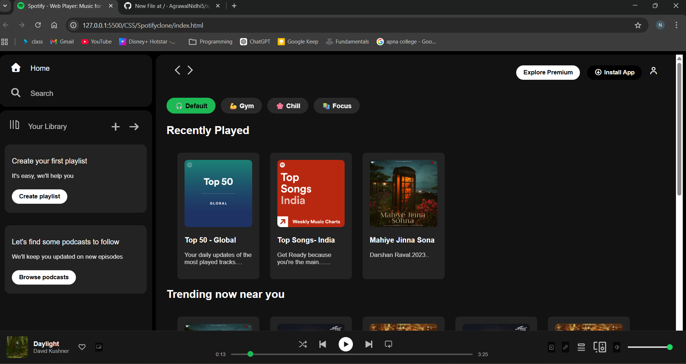
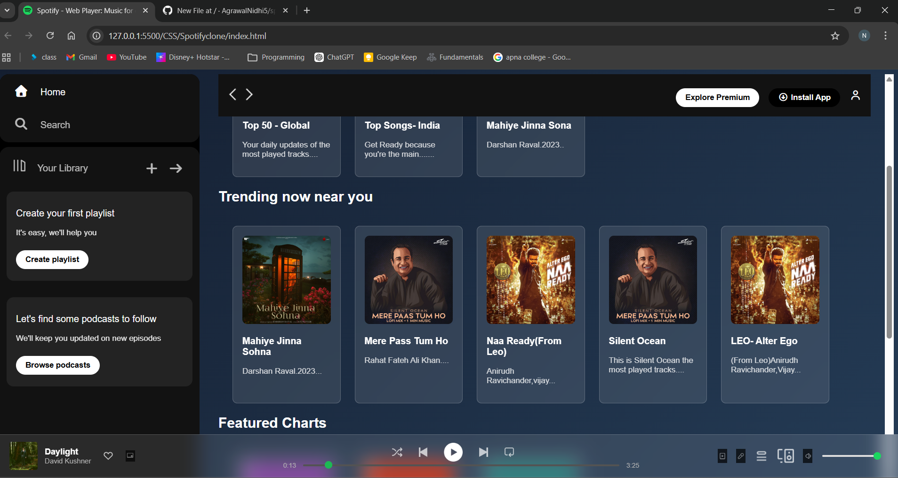

# 🎧 Spotify Web Player Clone (With Mood UI & Glassmorphism)

A responsive Spotify-inspired web player built using **HTML, CSS, and JavaScript**, enhanced with a custom Mood Mode feature and glassmorphism-based dynamic design.

---

## 🚀 Features

- ▶️ Play / Pause functionality  
- ⏱ Dynamic progress tracking  
- 🔊 Volume control  
- 🎨 Mood-based UI switching  
- 💎 Glassmorphism-based dynamic design  

---

## ✨ Mood Mode

An experimental UI enhancement that dynamically changes:

- Background gradients
- Activates glassmorphism effects
- Enhances overall visual experience

This feature was added after exploring the concept of modern UI trends like **Glassmorphism**.

---

## 🛠 Tech Stack

- HTML5  
- CSS3  
- JavaScript (Vanilla JS)  
- Audio API  
- DOM Manipulation  

---

## 🧠 What I Learned

- Handling audio using JavaScript
- DOM manipulation & event handling
- Creating dynamic UI themes
- Applying glassmorphism effects
- Structuring frontend projects cleanly

---

## 📸 Preview

## 📌 Future Improvements

- Playlist switching
- Multiple song support
- Visualizer animation
- React-based version

---

## 🔗 Connect

Built with curiosity and creativity while exploring frontend development.

